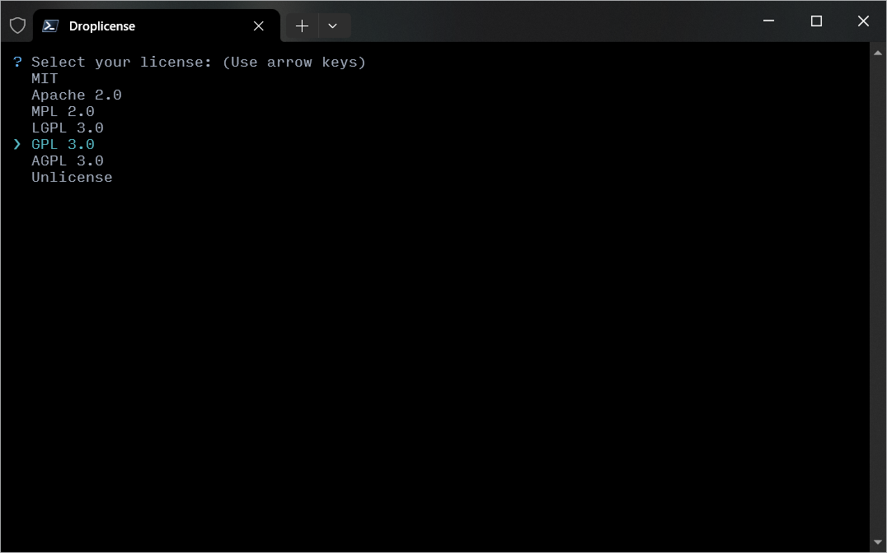
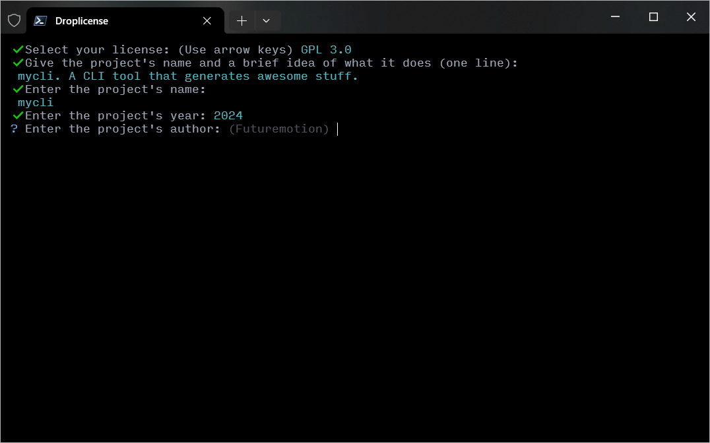

# droplicense
&nbsp;
> A Node.js CLI application for generating common licenses from the command line.
>
&nbsp;

## Installation

```
$ npm install -g droplicense
```

## Usage

```
$ droplicense
```

&nbsp;



---




## Licenses included

* Unlicense
* MIT
* Apache 2.0
* MPL 2.0
* GNU LGPL 3.0
* GNU GPL 3.0
* GNU AGPL 3.0

---

`droplicense` pulls licenses from http://choosealicense.com/ (which is [curated by GitHub](http://choosealicense.com/about/)), and creates a `LICENSE` file in the current working directory.